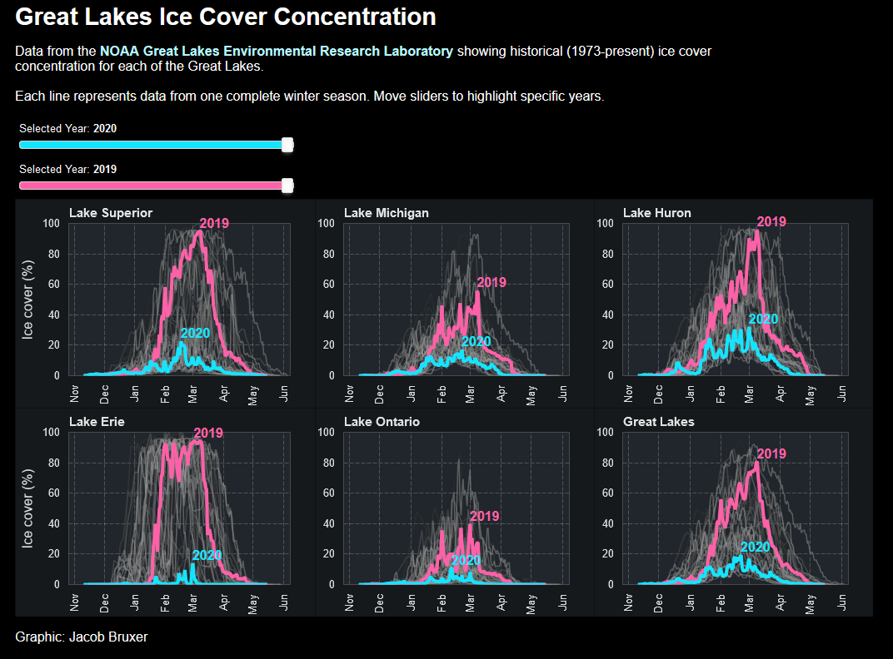

# Great Lakes Ice Cover Concentration

This is a Bokeh application to view Great Lakes daily ice cover concentration from NOAA's Great Lakes Environmental Research Laboratory.

A live version of this application can be launched with binder:

Static image of the application:

